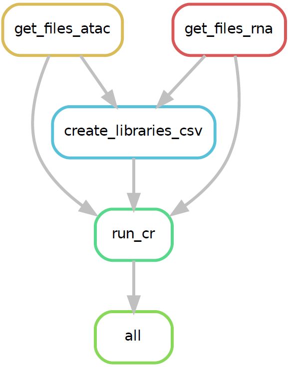

# retina-atlas
All files stored in "atlas_snakefiles" directory

**To run**
```
snakemake --cores all -s run_cr.snakefile
```
**Dependencies**
| Dependencies  |Link                                                                |
|:--------------|:-------------------------------------------------------------------|
| CellRangerARC |https://www.10xgenomics.com/support/software/cell-ranger-arc/latest |
| SRA_Toolkit   |https://github.com/ncbi/sra-tools/wiki/01.-Downloading-SRA-Toolkit  |
| Snakemake     |https://snakemake.readthedocs.io/en/stable/                         |

**Workflow**

