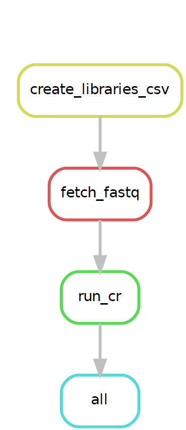

# retina-atlas
Workflow for processing sc-multiome and sc-atacseq data using CellRanger

## Dependencies
| Dependencies  |Link                                                                       |
|:--------------|:-------------------------------------------------------------------       |
| CellRangerARC |https://www.10xgenomics.com/support/software/cell-ranger-arc/latest        |
| CellRangerATAC|https://support.10xgenomics.com/single-cell-atac/software/downloads/latest |
| SRA_Toolkit   |https://github.com/ncbi/sra-tools/wiki/01.-Downloading-SRA-Toolkit         |
| Snakemake     |https://snakemake.readthedocs.io/en/stable/                                |
| PigZ          |https://zlib.net/pigz/                                                     |


## Debugging & Running 
### To Debug
```
snakemake -p --dry-run -s <insert snakefile name>
```

### To Run

```
snakemake --cores all --keep-incomplete --resources load=100
```

<div style="color: red;">
  <strong>Resources flag must be added when running Snakemake pipeline to ensure proper load management; modify according to computing power.</strong>
</div>
[For reference, 1 run_cr requires a load of 50; 256GB of ram allows for ~ 2 simultaneous runs of CellRanger.]

## Workflow

### #1 Preparation of "xxx_metadata.csv"

Most important step of entire workflow. Ensure format of xxx_metadata.csv is adhered to strictly; Format should be exactly as that of the "xxx_metadata.csv" file provided.


### #2 Adjusting parameters in config.yaml
The config.yaml file looks as follows:
```
#ATAC or multiome
type: "multiome"

#true or false
remove_fastq: 

path:
  #absolute path to working directory
  wd: "/home/users/astar/gis/stufrancis/scratch/RETINA_ATLAS/test_run_multiome"
  
  #relative path to reference genome, relative to snakefile
  ref_genome: "../../CellRangerFiles/refdata-cellranger-arc-GRCh38-2020-A-2.0.0"
  
  #absolute path to metadata.csv file generated in previous step
  metadata: "/home/users/astar/gis/stufrancis/scratch/RETINA_ATLAS/test_run_multiome/01_prep_metadata/test_run_multiome.csv"
  
  #absolute path to "02_snakemake_download_cellranger" process directory
  process_dir: "/home/users/astar/gis/stufrancis/scratch/RETINA_ATLAS/test_run_multiome/02_snakemake_download_cellranger"

#suffix of reads from SRA toolkit to be renamed to
#if the read does not exist, substitute with "ignore"
ATAC1 : "S1_L001_R1_001.fastq"
ATAC2 : "S1_L001_R2_001.fastq"
ATAC3 : "S1_L001_R3_001.fastq"
ATAC4 : "ignore"

RNA1 : "S1_L001_R1_001.fastq"
RNA2 : "S1_L001_R2_001.fastq"
RNA3 : "ignore"
RNA4 : "ignore"

##the name of the files must end in .fastq

```
Ensure config.yaml files is properly adjusted. For more information and to know what suffix to use, please refer to: https://www.10xgenomics.com/support/software/cell-ranger-arc/latest/tutorials/inputs/specifying-input-fastq-count

*Common mistakes include forgetting "ignore" in the suffixes section and mistyping respective paths, which may lead to errors.*

### #3 Maintaining proper directory structure & scheduling jobs
Prior to running the snakemake pipeline, ensure all files present.

    ```
    .
    ├── 01_prep_metadata/
    │   └── metadata.csv  
    ├── 02_snakemake_download_cellranger/ 
    ├── 03_Seurat_object/ 
    ├── snakemake
    ├── config.yaml
    └── xxx.sbatch #for job scheduling on hpc
    ```
Runs will be generated according to "ID" in metadata.csv [i.e. 1  "ID" will have 1 "outs" folder].

*Example of xxx.sbatch format to run pipeline:*
```
#!/bin/bash

#SBATCH -t 72:00:00
#SBATCH -N 1
#SBATCH --ntasks-per-node 60
#SBATCH --cpus-per-task 1
#SBATCH --mem 128G
#SBATCH -J CR_pipeline
#SBATCH --output=%x-%j.out
#SBATCH --error=%x-%j.err
#SBATCH -p cpu

snakemake --cores all --keep-incomplete --resources load=100

## sbatch run_nfcore_scrnaseq.sbatch
## squeue --job 1201585

```

## Snakemake rule pipeline

<center>
  
</center>


**More detailed instructions in subfiles.**
