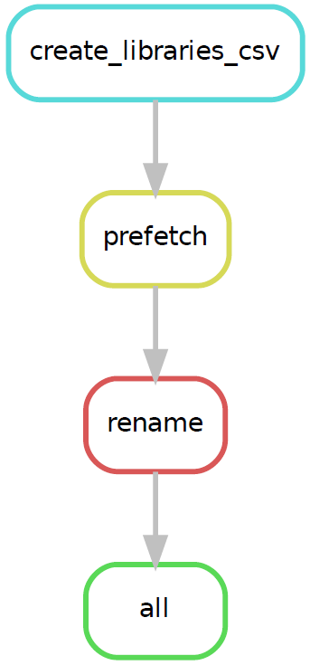
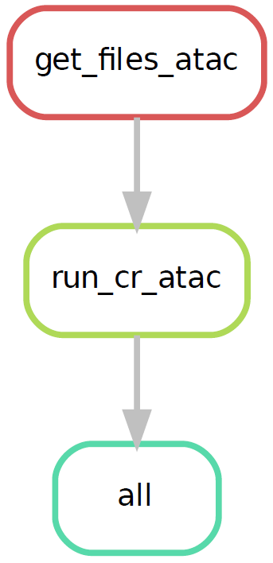

# retina-atlas
All files stored in "atlas_snakefiles_faster" directory

**To debug**
```
snakemake -p --dry-run -s <insert snakefile name>
```
**Dependencies**
| Dependencies  |Link                                                                       |
|:--------------|:-------------------------------------------------------------------       |
| CellRangerARC |https://www.10xgenomics.com/support/software/cell-ranger-arc/latest        |
| CellRangerATAC|https://support.10xgenomics.com/single-cell-atac/software/downloads/latest |
| SRA_Toolkit   |https://github.com/ncbi/sra-tools/wiki/01.-Downloading-SRA-Toolkit         |
| Snakemake     |https://snakemake.readthedocs.io/en/stable/                                |
| PigZ          |https://zlib.net/pigz/                                                     |

**Setup**

In the config.yaml file, with reference to location of scripts, change cd to absolute path, and ref_genome to relative path.

**Instructions**

Depending on the type of data being processed (Multiome vs ATAC-seq), download the relevant snakefiles; instructions in respective files.

**Workflow**

ATAC:


Multiome:


### More detailed instructions are in respective README files.